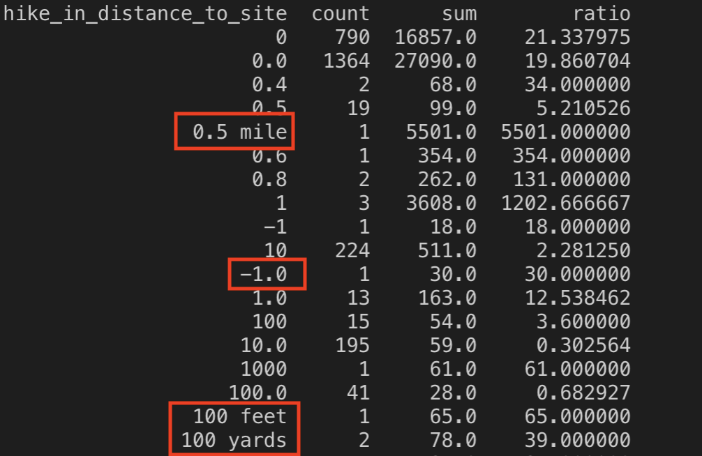
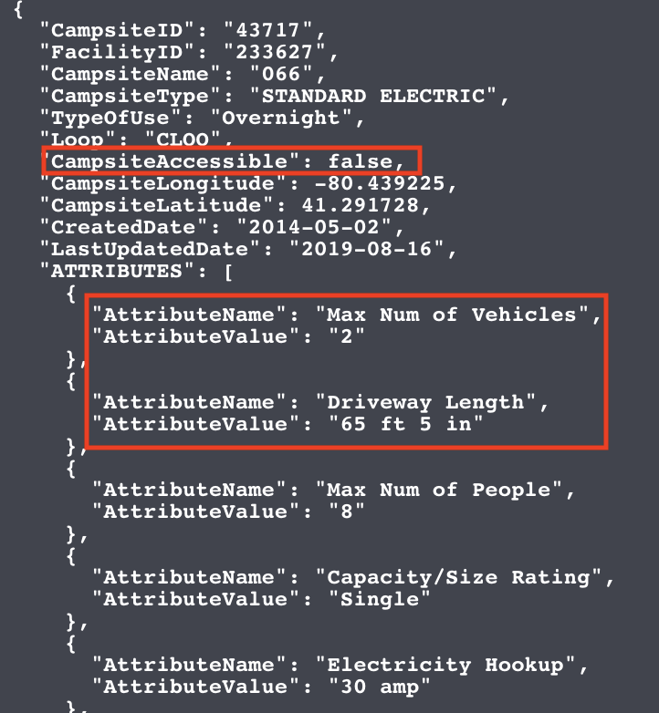
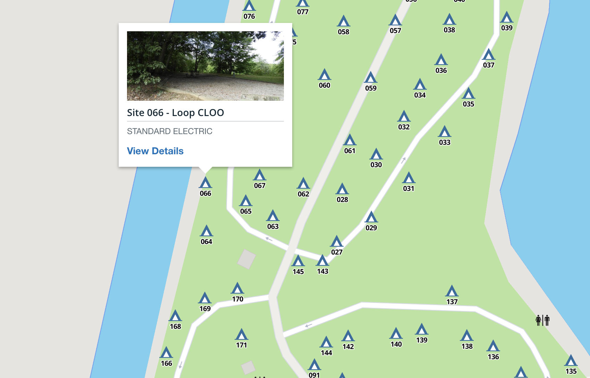
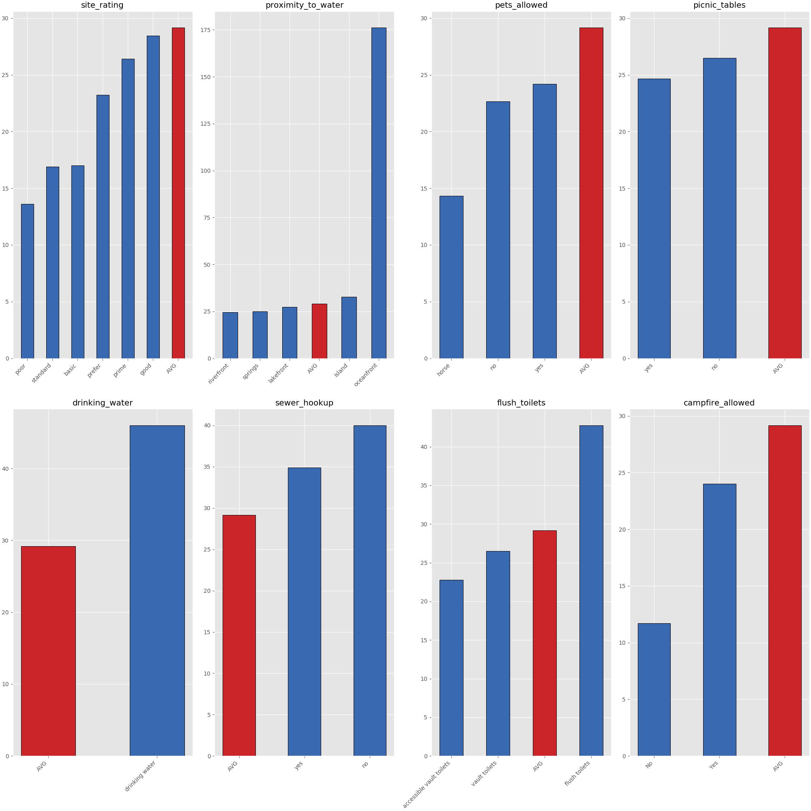
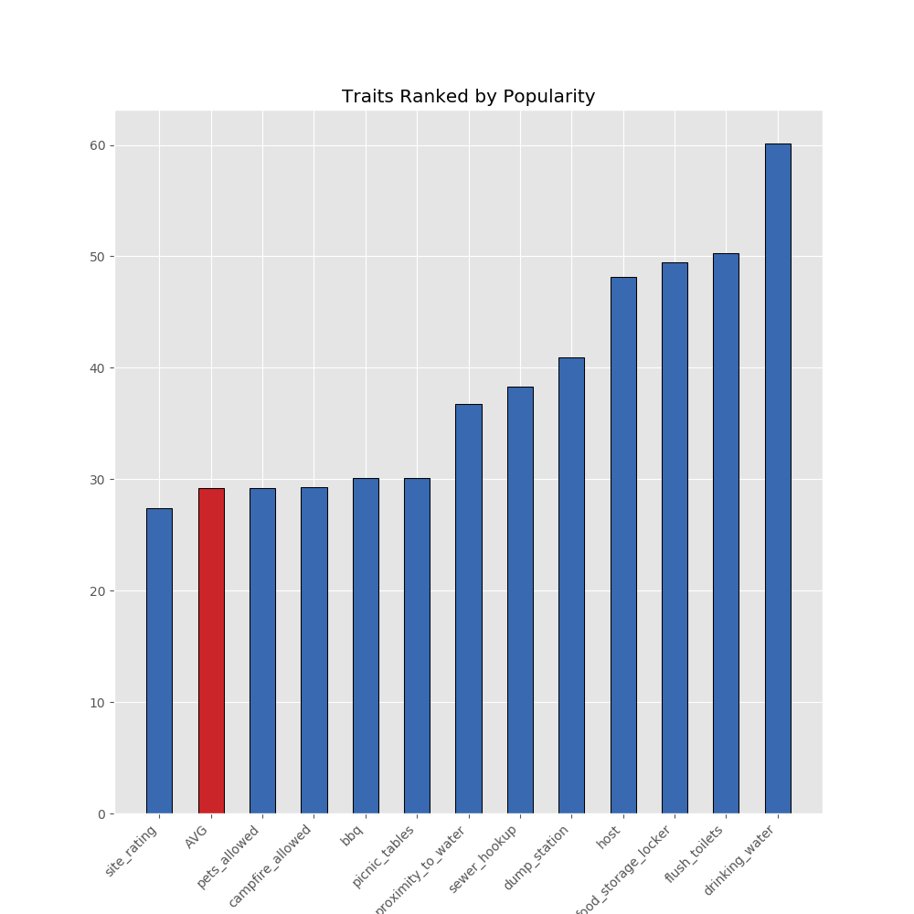

# Capstone 1 - Campsite Analysis or: How I Learned to Stop Worrying and Love Structured Data

Analyzing the recreation.gov data to find what traits make desirable campsites.

## Table of Contents

1. [Description](#description)
2. [Repo Instructions](#repo)
3. [Data Sources](#ds)
4. [Data Wrangling](#dw)
5. [Results](#results)
6. [Summary](#summary)
7. [Next Steps](#next)
8. [Technologies Use](#tech)

## Description
Recreation.Gov is the US Government's web portal for all its reservation needs. It covers tours, facility rentals, campsites and more. 

My goal for this case study was to get the unstructured attribute data for each campsite from the API into a relational database. From there I wanted to determine correlations between attributes and occupancy rates/total number of reservations in order to find what attributes have the greatest effect on campsite reservations. The main focus would be on creating a pipeline for importing this data and charts to illustrate the findings.

## Repo Instructions
In order to replicate the results in this readme, run the files in the src folder in the following order:
    
    1. mongo.py
    2. pandas_cleaning.py
    3. postgres.py
    4. data_analysis.py

You will need to generate your own API key from recreation.gov. Running the files in that order will query the API, put the results into a MongoDB database, clean attribute names to make them suitable for importing into Postgres

## Data Sources
The data came from two main channels. First the reservation data for 2018 was supplied as a single CSV. It was 3,299,805 rows (individual reservations) by 57 columns (attributes). The file was large enough (1.72GB CSV) that I ended up using Spark and SQL to group orders by campsite id's and returned the count for each id. I then exported this new smaller dataframe to a csv for importing into Postgres.

        Sample reservation data
        +--------+-----------------+
        |EntityID|reservation_count|
        +--------+-----------------+
        |     296|              167|
        |     467|              164|
        |    3959|              155|
        |    1090|              124|
        |   29573|              124|
        +--------+-----------------+

The second set of data came from Recreation.gov's API. Each campsite call gave a combination of 11 consistent, structured and an array of semi structured attributes. I say semi structured because they were consistently labeled in the JSON with keys and value pairs, but the number of attributes and the types of attributes varied by every campsite. It ended up being 75362 rows by 299 attribute columns. 

## Data Wrangling
One of the issues I struggled with was importing the attributes into a structured format. Each campsite had an unknown number of variables and unknown categorical value for each variable. 

My first attempt at cracking this was to make dataframes out of the resulting attribute names/values and the campsite id. Then I would use the pd.append() function to dynamically merge dataframes together. The Append function can sort the columns of the two dataframes and will place values where they match or make new columns and fill missing data with NaN values where they don't

Perfect! I don't need to know how many or which attributes each campsite has because Append will sort everything out for me. Except appending a new dataframe for each campsite and having it sort each column and fill NaN values really slows down with size.

        +----------------+--------------+
        | Number of Rows | Run Time     |
        |----------------|--------------|
        |   1000         |       9"     |
        |   2000         |       10"    |
        |   3000         |       59"    |
        |   75284        |   01:40:38"  |
        +----------------+--------------+
       
 

A much better solution is to find distinct attribute values in the MongoDB and use those to create a single dataframe with the campsite id's as the rows, the attributes as the columns, and populate it with NaN values. Then when cycling through each campsite, place attribute values where they belong in the existing dataframe. This cut the time down to 13:06.

The data was now in a relational database and the real cleaning could start! 

Except... the data was not consistent within categories. Here are the results for the attribute - "hike distance to site".

Or across column names. Among misspellings, plurals, and singulars the picnic table attribute read in a four different columns.

No problem! I wrote several functions to combine columns and fix the categorical data where I could. (Never did find a solution to identifying the varying units in hike distance to site)

Data cleaned I was ready to start analyzing. 

First up, I identified a facility, Shenango Recreation Park, with a large number of campsites and reservations. I wanted to look at the top and bottom campsites within this facility to see what attributes were responsible for their popularity, while holding the general location constant.

First up, the most reserved campsite in the camp - 

Huh, that's strange. CampsiteAccessible is flagged for false. According to the schema, that means the site is inaccessible by car. Why are most of its listed attributes centered around vehicles and driveways? 

Looking through the attributes alone I could not see a reason why this campsite was so popular. Instead I looked it up on the map to find this:

Looking on a map it's easy to see why this campsite would be so desirable, but there is nothing in its listed attributes that would capture this. Other campsites have attributes such as "proximity to water" and "lake access", but they were not used here.

I can envision another project using a program to look at the map and calculate distance from campsites to water visually, but that was outside the scope of this project.

When the cleaned data still has inconsistencies and does not capture important aspects of the campsite, I did not know how I could look at individual campsites and infer the attribute's importance.

Instead I came at it a different way and looked at how having a category listed affected the average number of reservations a campsite got. Here are my results.

## Results

Top Five Individual Campsites:
1) Yosemite
2) Zion
3) Grand Canyon
4) Yosemite
5) Sawnee Campground - Georgia

## Summary
Proximity to water, especially an ocean, seems to be the single largest contributor to reservation rate in these listed attributes. After that drinking water, showers, flushing toilets, and having a host seem to be indicators of high reservation rates. Unfortunately there are a lot of other factors at play here and it is difficult to draw definite conclusions. A host might be an indicator of a higher end campsite or a desirable location that needs additional supervision. The sample size of these attributes is small compared to the overall population size and the attributes are inconsistently applied. 

## Next Steps
 A feature that is not captured in the data, but I suspect is important for campsite reservations, is the distance from the campsite to a major metropolitan area. I want to use the Lat/Long for each campsite and make API calls an open source routing service to get information on driving times, distances, and elevations of the campsites. With this route/distance data I would do a hypothesis test that distance is a significant factor in occupancy rates.

 ## Technologies Used
 1) Python
 2) Pandas
 3) Matplotlib
 4) MongoDB
 5) Spark
 6) Postgres
 